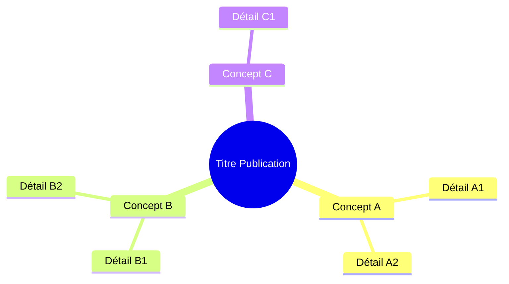
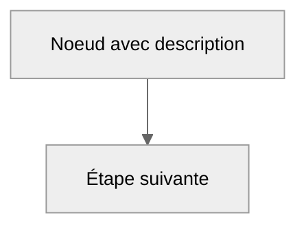

# Méthodologie : Documentation | Methodology: Documentation

## Objectif | Objective

FR: Cette méthodologie guide l'exécution des tâches de documentation — système et utilisateur. Elle est lue automatiquement par Claude avant d'exécuter une fonction du Knowledge Documentation. Elle consolide les standards de documentation pour ce projet.

EN: This methodology guides the execution of documentation tasks — system and user. It is automatically read by Claude before executing a Documentation Knowledge function. It inherits principles from `documentation-generation.md` (knowledge project) and adapts them to this project's context.

---

## Documentation système | System documentation

La documentation système couvre les fichiers essentiels, les méthodologies, et la structure du projet.

### Fichiers essentiels — Mise à jour universelle | Essential Files Update

**Chaque opération qui produit un livrable** (nouvelle méthodologie, nouveau skill, correction structurelle, évolution) **DOIT évaluer les fichiers essentiels pour mise à jour.** C'est une obligation héritée — aucune méthodologie n'en est exemptée.

| Fichier | Mettre à jour quand | Quoi mettre à jour |
|---------|---------------------|-------------------|
| `README.md` | Description, stats clés, ou structure change | Description, badges, résumé des fonctionnalités |
| `NEWS.md` | Tout livrable produit | Nouvelle entrée sous la section projet (date, changement, version) |
| `PLAN.md` | Nouvelle fonctionnalité, capacité, ou changement roadmap | Table What's New et/ou section Ongoing |
| `LINKS.md` | Nouvelle URL de page web créée | Ajouter URL aux sections Essentials ou Hubs; mettre à jour les compteurs |
| `VERSION.md` | Évolution knowledge ou changement structurel | Mettre à jour version/sous-version |
| `CLAUDE.md` | Nouvelle publication, commande, ou évolution | Table publications, table commandes, ou Knowledge Evolution |
| `CHANGELOG.md` | Issue créée ou PR fusionné | Ajouter entrée à la section date courante (issue/PR, type, titre, labels) |
| `STORIES.md` | Success story capturée OU publication web mise à jour | Ajouter entrée à la table Stories Index avec catégorie et date |

### Principe d'héritage | Inheritance Principle

Chaque fichier dans `methodology/` est un **enfant** de cette méta-méthodologie. Quand une opération spécifique s'exécute, elle hérite de la checklist universelle :

```
[étapes spécifiques à la méthodologie]
    → produire livrable (fichiers, PRs, publications)
    → PUIS : évaluer fichiers essentiels pour mise à jour
    → PUIS : commit et livrer tous les changements ensemble
```

### La règle simple

Si tu as changé quelque chose, vérifie si les fichiers essentiels doivent le savoir :
- Nouvelle méthodologie? → NEWS.md + CLAUDE.md
- Nouveau skill? → NEWS.md + CLAUDE.md
- Nouvelle capacité? → NEWS.md + PLAN.md
- Correction structurelle? → NEWS.md
- Nouveau success story? → STORIES.md + NEWS.md

**Les fichiers essentiels sont la mémoire du système** — si un changement n'y est pas reflété, il n'a pas eu lieu du point de vue de l'utilisateur.

---

## Documentation utilisateur | User documentation

La documentation utilisateur couvre les guides, tutoriels et documents créés pour les consommateurs du système (pas les développeurs).

### Principes

1. **Le "pourquoi" avant le "quoi"** — Chaque document commence par expliquer le besoin avant la solution
2. **Bilingue par défaut** — FR et EN, contenu technique en anglais (identifiants, code)
3. **Mind map obligatoire** — Chaque document inclut un diagramme mind map après l'abstract pour ancrage visuel
4. **Diagrammes au service du narratif** — Pas décoratifs, chaque diagramme supporte une explication

### Style d'écriture

| Convention | Quand | Exemple |
|------------|-------|---------|
| **Gras** | Première mention d'un concept clé | **Compilation incrémentale** |
| *Italiques* | Analogie, métaphore, qualités nommées | la qualité *autosuffisant* |
| `Backticks` | Code, fichiers, commandes | `methodology/session-protocol.md` |
| Tiret em (—) | Détail parenthétique | le système — conçu pour l'autonomie — s'adapte |

---

## Cycle de vie d'un document | Document Lifecycle

### Quand créer un nouveau document

Un document naît d'un **besoin réel d'ingénierie**, pas de spéculation.

| Déclencheur | Exemple |
|-------------|---------|
| Nouvelle capacité démontrée en pratique | Visualisation web (#16) depuis une session diagnostic |
| Pattern validé sur 2+ projets | Persistance session (#3) depuis MPLIB + STM32 |
| Découverte architecturale à préserver | Distributed Minds (#4) depuis le design harvest |
| Processus codifié à partir de travail manuel répété | Normalize (#6) depuis des audits structurels |
| Méta-analyse de connaissances accumulées | Architecture Analysis (#14) depuis revue système |

### Chemin de maturation

```
idée → notes/ (mémoire de session)
     → minds/ (récolté, cross-session)
     → patterns/ ou lessons/ (promu, validé)
     → source de publication (formalisé)
     → pages web EN/FR (publié)
```

**Points de décision** : Promouvoir depuis `minds/` quand validé sur 2+ projets ou quand l'insight est architecturalement significatif. Publier quand le contenu sert une audience au-delà du développeur.

---

## Structure d'un document source | Source Document Structure

Chaque source de publication (`publications/<slug>/v1/README.md`) suit cet ordre de sections :

### 1. Bloc titre

```markdown
# Titre — Sous-titre descriptif

**Publication #N · v1 · Mois AAAA**

---
```

### 2. Auteurs (toujours présents)

Deux auteurs, chacun avec une description de rôle expliquant sa contribution à *cette* publication spécifique.

### 3. Abstract (200–400 mots)

Trois patterns selon le type de publication :

| Pattern | Utiliser quand | Structure |
|---------|---------------|-----------|
| **Problème-Solution** | Documenter un fix ou une capacité | Problème → Comment le système le résout → Contexte |
| **Mécanisme-first** | Guides techniques et protocoles | Ce que ça fait → Pourquoi c'est distinctif → D'où ça vient |
| **Artefact vivant** | Hubs auto-référençants | Ce que c'est → Son rôle dans le système → Nature récursive |

### 4. Mind Map (standard — après l'abstract)

**Chaque publication inclut un mind map immédiatement après l'abstract.** C'est le premier ancrage visuel — un résumé de la portée en un coup d'oeil.



**Conventions mind map** :
- Noeud racine : titre de la publication ou concept central
- Premier niveau : 3–6 sujets principaux
- Deuxième niveau : détails clés par sujet (2–3 chacun)
- Garder scannable — pas plus de ~25 noeuds au total

### 5. Sections de contenu

Progression standard :

| Section | Objectif | Position typique |
|---------|----------|-----------------|
| **Contexte / Problème** | Pourquoi ça existe — le besoin d'ingénierie | Après mind map |
| **Solution / Mécanisme** | Comment ça fonctionne — architecture, protocole, approche | Milieu |
| **Implémentation** | Deep dives, code, workflows, exemples | Milieu-à-fin |
| **Résultats / Impact** | Résultats mesurés, données réelles | Près de la fin |
| **Principes de design** | Ce qu'on a appris, quels principes ont émergé | Près de la fin |
| **Publications reliées** | Références croisées vers frères/parents | Fin |

### 6. Pied de page

```markdown
---

*Auteurs: Martin Paquet & Claude (Anthropic, Opus 4.6)*
*Knowledge: [packetqc/knowledge](https://github.com/packetqc/knowledge)*
```

---

## Intégration des diagrammes | Diagram Integration

### Quand utiliser des diagrammes

| Position | Type de diagramme | Objectif |
|----------|------------------|----------|
| **Après abstract** | Mind map | Résumé visuel de la portée |
| **Section problème** | Flowchart | Visualiser le problème |
| **Section solution** | Flowchart / architecture | Montrer le mécanisme |
| **Sections processus** | Sequence / state diagram | Flux étape par étape |
| **Sections données** | Gantt / xychart | Timeline ou métriques |
| **Sections architecture** | Graph / flowchart | Relations entre composants |

### Sélection du type Mermaid

| Type | Syntaxe | Idéal pour |
|------|---------|-----------|
| `mindmap` | `mindmap` | Aperçu document, résumé de sujets |
| `flowchart TB` | `flowchart TB` | Hiérarchies top-down, flux de données |
| `flowchart LR` | `flowchart LR` | Pipelines gauche-à-droite, processus |
| `graph TB/LR` | `graph TB` | Topologie DAG, architecture |
| `sequenceDiagram` | `sequenceDiagram` | Séquences d'interaction, appels API |
| `stateDiagram-v2` | `stateDiagram-v2` | Machines à états, cycle de vie |
| `gantt` | `gantt` | Timelines, phases de déploiement |
| `xychart-beta` | `xychart-beta` | Visualisation de données, graphiques |

### Style des diagrammes



- Toujours inclure `%%{init: {'theme': 'neutral'}}%%` pour un rendu cohérent
- Utiliser `classDef` pour le code couleur des groupes fonctionnels
- Labels descriptifs avec `<br/>` pour les retours à la ligne
- Flèches directionnelles claires avec labels sur les arêtes
- Subgraphs pour le regroupement logique

### Préservation du source

Quand les diagrammes sont pré-rendus en images (PNG pour support dual-theme), le source Mermaid DOIT être préservé dans un bloc `<details>` immédiatement après l'élément `<picture>` :

```html
<picture>
  <source media="(prefers-color-scheme: dark)" srcset="assets/diagram-midnight.png">
  
</picture>
<details class="mermaid-source">
  <summary>Mermaid source</summary>
  (bloc mermaid ici)
</details>
```

**Règle** : L'image est l'artefact dérivé. Le source est la source unique de vérité. Ne jamais supprimer le source en déployant l'artefact.

---

## Conventions de tables | Table Conventions

| Type | Colonnes | Cas d'usage |
|------|----------|------------|
| **Feature table** | Feature · Description · Impact | Documenter des capacités |
| **Key-value** | Propriété · Valeur | Configuration, metadata |
| **Comparaison** | Item · Colonne A · Colonne B | Avant/après, options |
| **Inventaire** | Entité · Statut · Version · Détails | Suivi de collections |
| **Timeline** | Date · Événement · Impact | Historique, évolution |

### Règles de style des tables

- En-têtes clairs et concis (1–3 mots)
- **Gras** pour l'emphase dans les labels de catégorie
- `Backticks` pour les chaînes littérales (code, fichiers, commandes)
- Indicateurs emoji de sévérité : 🟢🟡🟠🔴⚪
- Tirets em (—) pour les valeurs absentes, pas "N/A"
- Syntaxe pipe markdown exclusivement — pas de tables HTML dans le source

---

## Style d'écriture étendu | Extended Writing Style

### Format de référence

| Type de référence | Format | Exemple |
|-------------------|--------|---------|
| Publication | `#N` + titre entre parenthèses | Publication #7 (Harvest Protocol) |
| Chemin fichier | Relatif depuis la racine repo en backticks | `methodology/metrics-compilation.md` |
| URL web | Filtre `{{ relative_url }}` en Jekyll | `{{ '/publications/knowledge-system/' | relative_url }}` |
| Cross-projet | Marqueur `→P<n>` | Publication #1 →P1 |
| Issue/PR | `#N` | Issue #334, PR #345 |

### Ton

- Technique mais orienté narratif
- Cadrer le "pourquoi" avant le "quoi"
- Éviter le jargon sans contexte
- Inclure les éléments humains et cas d'usage réels

---

## Structure de publication trois-tiers | Three-Tier Publication Structure

| Tier | Emplacement | Contenu | Audience |
|------|-------------|---------|----------|
| **Source** | `publications/<slug>/v1/README.md` | Contenu canonique complet | Développeur, instances AI |
| **Résumé** | `docs/publications/<slug>/index.md` | Abstract + highlights + liens vers complet | Lecteur rapide, partage social |
| **Complet** | `docs/publications/<slug>/full/index.md` | Documentation complète sur GitHub Pages | Lecteur approfondi, référence |

### Règles de synchronisation

- **Source → Complet** : Contenu complet, adapté pour le web (front matter, layout, cross-refs)
- **Source → Résumé** : Abstract, table clé, lien vers page complète. PAS une copie tronquée — un aperçu curé
- **Mind map** : Présent dans les TROIS tiers (source, résumé, complet)
- **Diagrammes** : Tous dans la page complète; diagrammes clés seulement dans le résumé
- **Assets** : Assets source copiés vers `docs/` par `pub sync`

### Miroirs bilingues

Chaque page existe en paire EN/FR :

```
docs/publications/<slug>/index.md          ↔ docs/fr/publications/<slug>/index.md
docs/publications/<slug>/full/index.md     ↔ docs/fr/publications/<slug>/full/index.md
```

**Différences front matter** : `permalink` (ajoute préfixe `/fr/`), `title` (traduit), `description` (traduit), `og_image` (variante `-fr-`).

**Contenu** : Les pages FR sont des traductions complètes, pas des versions tronquées. Tables, diagrammes et code restent en anglais (identifiants techniques). Le texte narratif est traduit.

---

## Contrat front matter des pages web | Web Page Front Matter Contract

| Champ | Format | Exemple |
|-------|--------|---------|
| `layout` | `publication` ou `default` | `publication` |
| `title` | 40–80 caractères | "Knowledge — Self-Evolving AI Engineering Intelligence" |
| `description` | Une phrase, optimisée SEO | "Master publication for the knowledge system..." |
| `pub_id` | "Publication #N" ou "Publication #N — Full" | "Publication #4a" |
| `version` | "vN" | "v2" |
| `date` | ISO AAAA-MM-JJ | "2026-02-26" |
| `permalink` | `/publications/<slug>/` | `/publications/knowledge-system/` |
| `og_image` | `/assets/og/<slug>-<lang>-cayman.gif` | `/assets/og/knowledge-system-en-cayman.gif` |
| `keywords` | Séparés par virgule, 4–8 termes | "knowledge, bootstrap, methodology" |

---

## Checklist qualité | Quality Checklist

Avant de publier ou livrer une publication :

- [ ] Tous les champs front matter présents et corrects
- [ ] Abstract répond au "pourquoi" + "quoi" + contexte (200–400 mots)
- [ ] Mind map présent après l'abstract
- [ ] Diagrammes supportent le narratif (pas décoratifs)
- [ ] Tables utilisent un format cohérent (pipes markdown, en-têtes gras)
- [ ] Trois tiers créés : source + résumé + complet
- [ ] Miroirs bilingues existent (EN + FR) pour toutes les pages web
- [ ] Webcard générée (ou placeholder) et `og_image` défini
- [ ] Publications reliées linkées
- [ ] Publication listée dans les indexes EN/FR
- [ ] Publication listée dans `publications/README.md` index maître
- [ ] Publication listée dans la table CLAUDE.md
- [ ] STORIES.md mis à jour (si success story capturée)
- [ ] Références croisées vers publications soeurs incluses
- [ ] `pub check` passe sans erreurs

---

## Related

- `methodology/metrics-compilation.md` — Routine de compilation des métriques
- `methodology/time-compilation.md` — Routine de compilation du temps
- `.claude/skills/github/SKILL.md` — Protocole commentaires temps réel bidirectionnels
- `methodology/audience.md` — Définition des 19 segments d'audience
- `methodology/web-production-pipeline.md` — Chaîne de traitement Jekyll
- `methodology/web-page-visualization.md` — Pipeline de rendu local
- `methodology/web-pagination-export.md` — Pipeline d'export PDF/DOCX
